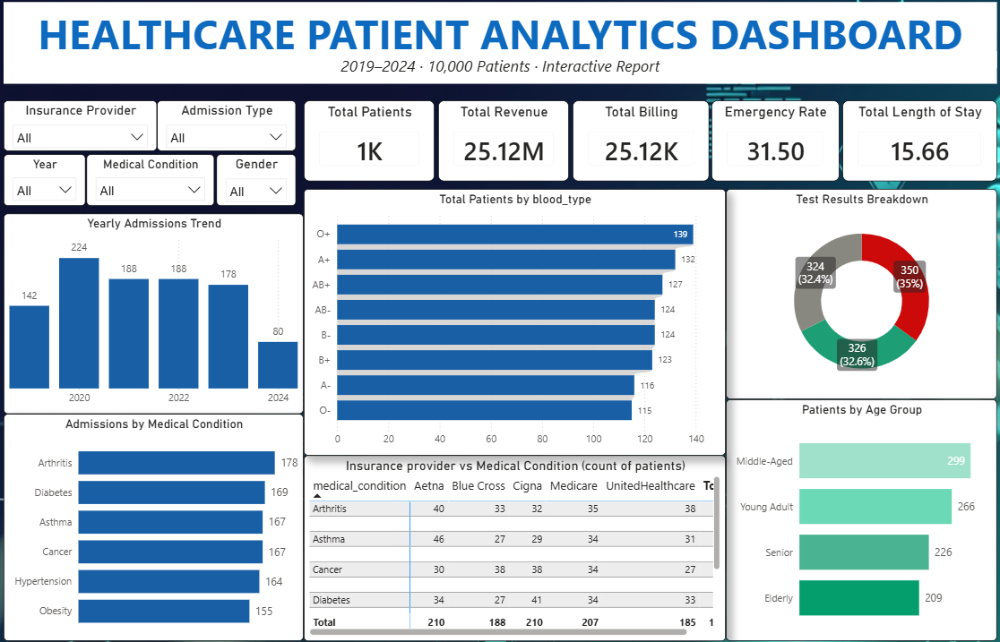
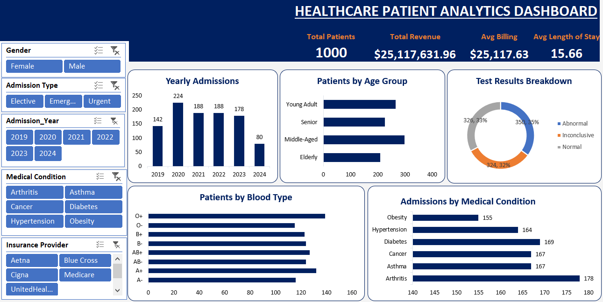

# Healthcare Patient Analytics — End-to-End Data Analytics Project


---

## Project Overview

This is a complete end-to-end data analytics portfolio project built on a synthetic healthcare dataset sourced from Kaggle. The project covers every stage of the data analytics pipeline, from raw data acquisition and cleaning, through exploratory analysis, to interactive dashboards and a written analytical report with recommendations.

The project demonstrates proficiency across four industry-standard tools:

- **MySQL** - Structured data cleaning and feature engineering
- **Python (pandas)** - Statistical cleaning, outlier detection, and exploratory data analysis
- **Power BI** - Interactive professional dashboard with DAX measures and slicers
- **Microsoft Excel** - Pivot-table-based dashboard replicating the Power BI visuals

> This project is also documented as a content series on TikTok [@YourHandle] for data analytics beginners.

---

## Dashboard Preview

### Power BI Dashboard


### Excel Dashboard


---

## Repository Structure

```
healthcare-patient-analytics/
|
+-- data/
|   +-- raw/
|   |   +-- healthcare_dataset.csv          (Original Kaggle download, untouched)
|   +-- cleaned/
|       +-- healthcare_final.csv            (Final cleaned dataset used in dashboards)
|
+-- sql/
|   +-- cleaning_script.sql                 (Full MySQL cleaning and feature engineering script)
|
+-- python/
|   +-- cleaning.ipynb                      (Full pandas cleaning, outlier detection, and EDA)
|   +-- eda_overview.png                    (EDA visualisation output)
|
+-- dashboards/
|   +-- powerbi/
|   |   +-- Healthcare_Dashboard.pbix       (Power BI dashboard file)
|   |   +-- dashboard_preview.png           (Screenshot preview)
|   +-- excel/
|       +-- Healthcare_Dashboard.xlsx       (Excel dashboard file)
|       +-- dashboard_preview.png           (Screenshot preview)
|
+-- reports/
|   +-- Healthcare_Analytics_Report_v2.pdf  (Full analytical report with findings and recommendations)
|
+-- README.md
```

---

## Dataset

| Property | Detail |
|---|---|
| **Source** | [Kaggle - Healthcare Dataset by Prasad](https://www.kaggle.com/datasets/prasad22/healthcare-dataset) |
| **Type** | Synthetic patient records |
| **Raw Records** | 10,000 rows |
| **Clean Records** | 9,998 rows (2 duplicates removed) |
| **Columns** | 15 original + 6 engineered = 21 total |
| **Period** | 2019 to 2024 |

### Original Columns

| Column | Type | Description |
|---|---|---|
| `Name` | Text | Patient full name |
| `Age` | Integer | Patient age in years |
| `Gender` | Text | Male / Female |
| `Blood Type` | Text | ABO blood group |
| `Medical Condition` | Text | Primary diagnosis |
| `Date of Admission` | Date | Hospital admission date |
| `Doctor` | Text | Attending physician |
| `Hospital` | Text | Facility name |
| `Insurance Provider` | Text | Insurance company |
| `Billing Amount` | Decimal | Total bill in USD |
| `Room Number` | Integer | Ward/room number |
| `Admission Type` | Text | Elective / Emergency / Urgent |
| `Discharge Date` | Date | Discharge date |
| `Medication` | Text | Prescribed medication |
| `Test Results` | Text | Normal / Abnormal / Inconclusive |

### Engineered Columns

| Column | Description |
|---|---|
| `Length_of_Stay` | Days between admission and discharge |
| `Age_Group` | Pediatric / Young Adult / Middle-Aged / Senior / Elderly |
| `Billing_Category` | Low (under $10K) / Medium ($10K to $30K) / High (over $30K) |
| `Admission_Month` | Numeric month (1 to 12) |
| `Admission_Year` | Year of admission |
| `Admission_Month_Name` | Full month name |

---

## Phase 1 - Data Cleaning (MySQL)

**Script:** `sql/cleaning_script.sql`

The MySQL cleaning phase handled structural data quality across the following steps:

| Step | Action |
|---|---|
| 1 | Created a working copy of the raw table to preserve the original data |
| 2 | Explored the dataset: row counts, distinct values, and numeric ranges |
| 3 | Detected and removed 2 fully duplicate rows |
| 4 | Checked all columns for NULL values and empty strings - none found |
| 5 | Standardised text columns: trimmed whitespace, fixed casing for Gender, Admission Type, and Test Results |
| 6 | Converted date columns from TEXT to DATE format using STR_TO_DATE() |
| 7 | Rounded all billing amounts to 2 decimal places |
| 8 | Engineered 6 new calculated columns for richer analysis |
| 9 | Exported the clean table as healthcare_cleaned.csv |

**Key SQL snippet - Feature Engineering:**

```sql
-- Age Group segmentation
ALTER TABLE healthcare_working ADD COLUMN Age_Group VARCHAR(20);
UPDATE healthcare_working
SET Age_Group = CASE
  WHEN Age < 18 THEN 'Pediatric'
  WHEN Age BETWEEN 18 AND 35 THEN 'Young Adult'
  WHEN Age BETWEEN 36 AND 55 THEN 'Middle-Aged'
  WHEN Age BETWEEN 56 AND 70 THEN 'Senior'
  ELSE 'Elderly'
END;

-- Length of Stay
ALTER TABLE healthcare_working ADD COLUMN Length_of_Stay INT;
UPDATE healthcare_working
SET Length_of_Stay = DATEDIFF(`Discharge Date`, `Date of Admission`);
```

---

## Phase 2 - Data Cleaning (Python / pandas)

**Notebook:** `python/cleaning.ipynb`

The Python phase performed statistical validation and exploratory data analysis on the MySQL-exported file:

| Step | Action | Result |
|---|---|---|
| 1 | Loaded CSV exported from MySQL | 9,998 rows, 21 columns |
| 2 | Standardised column names to lowercase with underscores | Completed successfully |
| 3 | Corrected data types: datetime and numeric coercion | No coercion errors found |
| 4 | Checked for missing values across all columns | None found |
| 5 | Checked for logical duplicates (name + admission date + billing) | None found |
| 6 | Detected outliers using the IQR method for age, billing, and length of stay | None detected |
| 7 | Generated 6-panel EDA visualisation saved to reports/ | eda_overview.png |
| 8 | Ran final validation report | All checks passed |
| 9 | Exported final clean file | healthcare_final.csv |

**Key Python snippet - Outlier Detection:**

```python
def detect_outliers(df, column):
    Q1 = df[column].quantile(0.25)
    Q3 = df[column].quantile(0.75)
    IQR = Q3 - Q1
    lower = Q1 - 1.5 * IQR
    upper = Q3 + 1.5 * IQR
    outliers = df[(df[column] < lower) | (df[column] > upper)]
    print(f"{column}: {len(outliers)} outliers | Range: {lower:.1f} to {upper:.1f}")
    return lower, upper
```

---

## Phase 3 - Power BI Dashboard

**File:** `dashboards/powerbi/Healthcare_Dashboard.pbix`

### Dashboard Features

- Single-page overview with full interactivity
- 5 dropdown slicers: Insurance Provider, Admission Type, Year, Medical Condition, Gender
- 4 KPI cards: Total Patients, Total Revenue, Average Billing, Average Length of Stay
- 5 charts: Yearly Admissions Trend, Admissions by Medical Condition, Patients by Blood Type, Test Results Breakdown, Patients by Age Group
- DAX measures for all KPI calculations
- Date Table created in DAX with Mark as Date Table enabled

### DAX Measures

```dax
Total Patients = COUNTROWS(healthcare_final)

Total Revenue = SUM(healthcare_final[billing_amount])

Avg Billing = AVERAGE(healthcare_final[billing_amount])

Avg Length of Stay = AVERAGE(healthcare_final[length_of_stay])

Emergency Admissions =
CALCULATE(
    COUNTROWS(healthcare_final),
    healthcare_final[admission_type] = "Emergency"
)

Abnormal Rate % =
DIVIDE(
    CALCULATE(COUNTROWS(healthcare_final), healthcare_final[test_results] = "Abnormal"),
    COUNTROWS(healthcare_final),
    0
) * 100
```

---

## Phase 4 - Excel Dashboard

**File:** `dashboards/excel/Healthcare_Dashboard.xlsx`

### Dashboard Features

- 3-sheet workbook structure: RAW_DATA, PIVOT_DATA, DASHBOARD
- 5 slicers connected simultaneously to all pivot tables
- 4 KPI cards linked directly to pivot table values
- 5 pivot charts matching the Power BI visuals exactly
- No gridlines, no row or column headers for a clean dashboard presentation

### Sheet Structure

| Sheet | Contents |
|---|---|
| `RAW_DATA` | Imported CSV as a named Excel Table (HealthcareData) |
| `PIVOT_DATA` | 6 pivot tables powering all charts and KPI cards |
| `DASHBOARD` | Final visual layout with charts, slicers, and KPI cells |

---

## Key Findings

### 1. Admissions Grew 25.4% from 2019 to 2023
Patient admissions rose from 142 in 2019 to a peak of 224 in 2020, stabilising between 178 and 188 in subsequent years. The 2024 figure reflects a partial year only and is excluded from trend comparisons.

### 2. Chronic Diseases Dominate Admissions
Over 66% of admissions are driven by chronic non-communicable diseases: Arthritis (17.8%), Diabetes (16.9%), Hypertension (16.4%), and Obesity (15.5%).

### 3. High Rate of Abnormal and Inconclusive Test Results
67.6% of all test results were either Abnormal (35.0%) or Inconclusive (32.6%), indicating a high proportion of patients requiring further clinical attention post-discharge.

### 4. Blood Type Distribution Consistent with Global Prevalence
O+ (13.9%) and A+ (13.2%) are the most common blood types, consistent with global epidemiology and relevant for blood bank inventory planning.

### 5. Older Adults Represent a Significant Share of Admissions
Patients aged 56 and above (Senior and Elderly combined) account for 43.5% of all admissions, highlighting the need for geriatric care capacity planning.

---

## Recommendations

| No. | Area | Recommendation |
|---|---|---|
| 1 | Chronic Disease | Establish dedicated management clinics for Diabetes, Hypertension, Arthritis, and Obesity |
| 2 | Diagnostics | Implement mandatory 30-day follow-up for Abnormal results; 7-day repeat test for Inconclusive results |
| 3 | Capacity Planning | Model bed and staffing capacity against a projected 5 to 10% annual admission growth rate |
| 4 | Blood Bank | Prioritise O+ and A+ replenishment; maintain buffer stock of A- and O- for emergency use |
| 5 | Billing | Audit long-stay cases exceeding the 15.5-day average for discharge planning inefficiencies |

---

## How to Run This Project

### Requirements

```
Python 3.8+
pandas
numpy
matplotlib
seaborn
openpyxl

MySQL Workbench 8.0+
Power BI Desktop (free)
Microsoft Excel 2016+
```

### Setup Instructions

**1. Clone the repository**
```bash
git clone https://github.com/denko5/healthcare-patient-analytics.git
cd healthcare-patient-analytics
```

**2. Install Python dependencies**
```bash
pip install pandas numpy matplotlib seaborn openpyxl
```

**3. Run MySQL cleaning**
- Open MySQL Workbench
- Create the database: `CREATE DATABASE healthcare_project;`
- Import `data/raw/healthcare_dataset.csv` using the Table Data Import Wizard
- Run `sql/cleaning_script.sql` in full
- Export the result as `data/cleaned/healthcare_cleaned.csv`

**4. Run the Python notebook**
```bash
jupyter notebook python/cleaning.ipynb
```
Output: `data/cleaned/healthcare_final.csv`

**5. Open the dashboards**
- Power BI: Open `dashboards/powerbi/Healthcare_Dashboard.pbix` in Power BI Desktop
- Excel: Open `dashboards/excel/Healthcare_Dashboard.xlsx` in Microsoft Excel

---

## Full Report

A complete analytical report is available at `reports/Healthcare_Analytics_Report_v2.pdf`

The report covers:
- Executive Summary
- Methodology (data source, tools, full cleaning steps for MySQL and Python)
- Key Findings (one section per dashboard visual)
- KPI Summary
- Recommendations (5 data-driven recommendations)
- Limitations
- Conclusion
- Appendix: Full Data Dictionary (all 21 columns)

---

## About the Author

**Denis** - Data Analyst | Field System Admin Officer, Kilifi County Referral Hospital (KCRH), Kenya

- TikTok: @code.ke - Data analytics content for beginners (46K+ followers)
- LinkedIn: Denis Kombe
- GitHub: https://github.com/denko5

---

## License

This project is open source and available under the [MIT License](LICENSE).

The dataset is synthetic and sourced from Kaggle under public use terms. No real patient data was used at any stage of this project.

---

*Built as a portfolio project demonstrating end-to-end data analytics skills across MySQL, Python, Power BI, and Microsoft Excel.*
